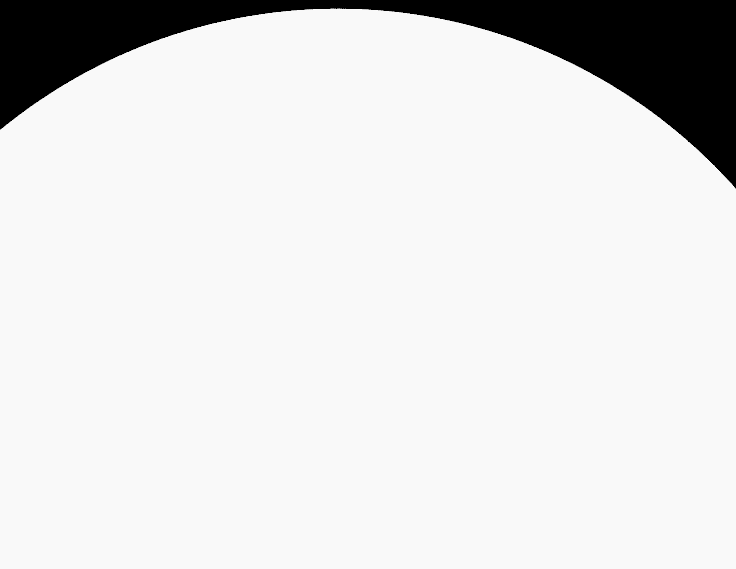

CUDA Path Tracer
================

**University of Pennsylvania, CIS 565: GPU Programming and Architecture, Project 3**

* Harry Guan
* Tested on: Windows 11, Intel i7-14700 @ 2.10GHz 32GB, NVIDIA T1000 4GB (Moore 100B virtual labs)
* 4 Late days used

### Project Overview

This project implements a GPU-accelerated Monte Carlo path tracer using CUDA, capable of rendering  images with global illumination, material properties, and texture mapping. The path tracer supports various geometry types including spheres, cubes, and complex OBJ meshes with multi material support.

||

#### Technical Implementation

The path tracer is built on a modular architecture:

- **`pathtrace.cu`**: Core path tracing kernels and scene setup
- **`intersections.cu`**: Ray-primitive intersection tests
- **`interactions.cu`**: Material scattering and BSDF evaluation
- **`scene.cpp`**: Scene loading and OBJ parsing with texture support
- **`texture.cpp`**: Image loading and CUDA texture management
- **`bvh.cpp`**: Bounding Volume Hierarchy construction and traversal


### Scene File Format

The path tracer uses JSON format for scene description. Here's the structure:

```json
{
    "Materials": {
        "diffuse_material": {
            "TYPE": "Diffuse",
            "RGB": [R, G, B]
        },
        "emissive_material": {
            "TYPE": "Emitting",
            "RGB": [R, G, B],
            "EMITTANCE": value
        },
        "specular_material": {
            "TYPE": "Specular",
            "RGB": [R, G, B]
        },
        "refractive_material": {
            "TYPE": "Refractive",
            "RGB": [R, G, B],
            "IOR": 1.5
        },
        "textured_material": {
            "TYPE": "Diffuse",
            "RGB": [R, G, B],
            "TEXTURE": "path/to/texture.png"
        }
    },
    "Camera": {
        "RES": [width, height],
        "FOVY": field_of_view_degrees,
        "ITERATIONS": max_samples_per_pixel,
        "DEPTH": max_bounce_depth,
        "FILE": output_filename,
        "EYE": [x, y, z],
        "LOOKAT": [x, y, z], 
        "UP": [x, y, z]
    },
    "EnvironmentHDR": "path/to/environment.hdr",
    "Objects": [
        {
            "TYPE": "sphere" or "cube" or "mesh",
            "FILE": "path/to/model.obj", // only for mesh type
            "TRANS": [x, y, z], // translation
            "ROTAT": [x, y, z], // rotation in degrees
            "SCALE": [x, y, z], // scale factors
        }
    ]
}
```

### Implementation Features

## Refraction

Refraction simulates light bending at material interfaces using Snell's law and Fresnel equations, creating realistic glass and transparent materials. The implementation handles both entering and exiting material interfaces with proper index of refraction ratios, while Fresnel reflection increases at grazing angles to produce authentic glass appearance with energy conserving light transport. 


|||
|:-:|:-:|
|Diffuse Sphere|Specular Sphere|

## Physically-based Depth of field

Physically-based depth-of-field simulates camera focus by jittering rays within an aperture, creating sharp focus on the focal plane and blur for objects outside it. A larger aperture increases the blur, mimicking real-world optics.

|||
|:-:|:-:|

## OBJ Support + Texture Mapping

OBJ loading enables complex models with multiple textures and materials by parsing MTL files and assigning per-triangle material IDs. The implementation automatically loads textures, handles UV coordinate mapping with V-flip correction, and creates materials with proper sRGB to linear conversion for realistic rendering.

Texture mapping utilizes CUDA's hardware-accelerated bilinear filtering through texture objects, eliminating manual interpolation overhead. The system supports diffuse texture mapping with proper sRGB to linear conversion, alpha channel transparency, and efficient GPU memory management for high-resolution textures.

||
|:-:|:-:|

## Environment HDR Lighting

HDR environment mapping provides realistic outdoor lighting through importance-sampled environment maps using alias method sampling. The implementation converts HDR environment data into probability distributions for efficient light sampling, creating natural lighting with proper energy distribution and realistic sky illumination. 

||
|:-:|:-:|

## Stochastic Antialiasing

Stochastic antialiasing jitters camera rays within each pixel across multiple iterations to produce smooth anti-aliased edges. This removes jagged artifacts and creates realistic edges in the final render.

|||
|:-:|:-:|
|No Antialiasing|With Antialiasing|


## BVH Acceleration

Bounding Volume Hierarchy acceleration structure optimizes ray-mesh intersections by organizing geometry into hierarchical bounding boxes. The implementation reduces intersection complexity from O(n) to O(log n) for complex meshes, dramatically improving rendering performance for detailed 3D models. Performance wise, a 100k triangle mesh wasn't able to be simulated, but otherwise with BVH on, the 80k triangle was able to be simulated with 0.3 fps

## Russian Roulette Path Termination

Russian Roulette efficiently terminates low-contribution light paths to focus computational resources on high-impact rays. The implementation uses probabilistic termination based on path color intensity, maintaining unbiased rendering while significantly reducing computation time for deep bounces. Performance wise, scenes with 8 bounces and Russian Roulette enabled achieved 1.5x faster rendering compared to scenes without Russian Roulette, while maintaining the same visual quality.


## Bloopers

||
|:-:|:-:|

